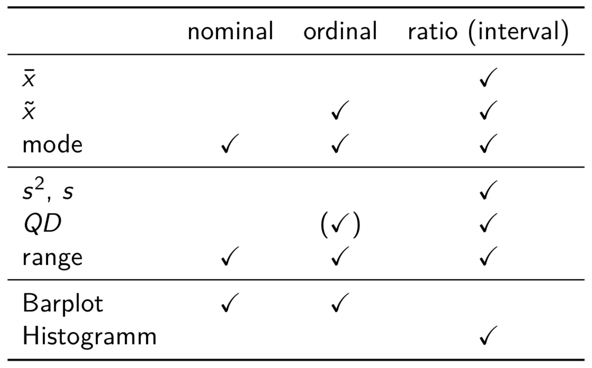

# Objectives

* Create descriptive statistics and graphs.
* Be able to give a short and accurate numerical and graphical summary of the data used for statistical analysis.
* Calculate means and standard deviations of a distribution of observations.
* **`R`**: working with vector and matrix objects (indexing, numerical operations), simple graph annotations.


## Descriptive statistics

**Usage:**

* To obtain an initial idea of the dataset.
* To perform data cleaning.
* To determine the most important characteristics of different variables in a dataset.

<hr>

Different descriptives for nominal/ordinal (**discrete**) and metric (**continuous**) data.

### Discrete data

* **Nominal scale:** categories or qualitative classifications
  
  possible mathematical operations: =, &ne;
  
  e.g.: male, female
  
  **`R`** data type: character, logical, factor


* **Ordinal scale:** sorted categories
  
  possible mathematical operations: >,<,&ge;,&le;
  
  e.g.: **likert scale**: completely agree, mostly agree, mostly disagree, completely disagree (subclass of **rating scale**, sometimes treated as *pseudo-meteric*)
  
  **`R`** data type: factor, numeric (integer)


### Continuous data

* **Interval scale:** scales with an arbitrary defined zero point
  
  possible mathematical operations: +,-
  
  e.g.: celsius scale, direction (measured in degrees from true or magnetic north), also sometimes rating scales (attitude and opinion scales)
  
* **Ratio scale:** possesses a meaningful zero value, most measurement in the physical sciences and engineering is done on ratio scales

  possible mathematical operations: &lowast;, &divide;
  
  e.g.: kelvin scale, age, income, price, costs, sales revenue, sales volume, market share, ...
  
  **`R`** data type: numeric (double)


# Discrete variables

## Frequency tables

**Usage:**

* To obtain a count of the number of responses associated with different values of one or more variables.
* To indicate how scores of respondents are distributed over meaningful categories.

**Possible research questions for frequency tables of a single variable**

* What is the range of response values?
* What is the distribution of the responses? (e.g. highest? lowest?)
* How does it look like when responses are collapsed? (e.g. if there are few responses in some categories)
* Is there a substantial (e.g. neutral) response?
* How large is the missing data component and what effect does it have (on the results)?


**Example:** *Trump's twitter behavior*

5109 words obtained from tweets based on Trump's phones (during the presidential election campaign in 2016) had been categorized into 10 sentiments using the NRC Word-Emotion Association lexicon.

**Research question:** How is the word sentiment of tweets distributed?

```
# generate the data
name <- c("anger", "anticipation", "disgust", "fear","joy", "negative", "positive", "sadness","surprise", "trust")
dat <- c(rep(name[1],490), rep(name[2],428), rep(name[3],304),rep(name[4],403), rep(name[5],355), rep(name[6],820),
         rep(name[7],967), rep(name[8],450), rep(name[9],266),rep(name[10],626))
```
```
# inspect the data
head(dat)
```
```
# obtain a frequency table
table(dat)
```
```
# obtain the total number of observations
length(dat)

sum(table(dat))
# gives the same result (but taking NAs into account)
```

**relative values**

```
table(dat)/sum(table(dat))

# or alternatively use
prop.table(table(dat))
```

**percentages**

```
table(dat)/sum(table(dat))*100

# or alternatively use
prop.table(table(dat))*100
```


## Bar charts

**Usage:**

* To display the results from a frequency table in a graph.
* To depict the number of observations for every possible observed response (= visual representation of the data makes it easier to see patterns in it).

What can this mean?

<p align="center">
            
</p>


### Standard graph

```
# frequencies
barplot(table(dat))

# percentages
barplot(prop.table(table(dat))*100)

# change the colors
barplot(prop.table(table(dat))*100, col="grey40")

# delete the box borders
barplot(prop.table(table(dat))*100, col="grey40", border=NA)

# rotate the bar labels
barplot(prop.table(table(dat))*100, col="grey40", border=NA, las=3)
```

<p align="center">
            
</p>

**Hint:** To obtain the list of possible (named) colors available try:

```
colors()
```

For more graph annotations try:
``` 
?barplot
```

### ggplot

```
# load ggplot
library(ggplot2)

# convert word table into a data frame
dat2 <- as.data.frame(prop.table(table(dat))*100)

bar <- ggplot(data=dat2, aes(x=dat, y=Freq)) +
     geom_bar(stat="identity")
bar

# change the axis labels
bar <- bar + xlab("") + ylab("")
bar

# rotate the bars
bar <- bar + coord_flip()
bar

# change the background (theme)
bar <- bar + theme_minimal()
bar
```


# Continuous variables

## Measures of location and dispersion

**Usage:**

* To determine the most important characteristics of non-nominal (i.e. **ordinal** or **continuous**) data.
* To summarize the characteristics of a variable in one statistical indicator.
* To provide an indication of the variability in a set of scores on a variable.

### Measures of location

* **Mean** $\bar{x}$ (average):

  $$\bar{x} = \frac{1}{n} \sum_{i = 1}^{n} x_i$$
  
  e.g.: $\bar{x} = (7 + 10 + 16 + 9 + 12 + 13 + 9 + 8 + 10 + 9)/10 = 10.3$}
  
* **Mode** (most frequent value):
  
  e.g.: mode = 9 (appears 3 times)

* **Median** $\tilde{x}$ (value in the middle):

  e.g.: 7 8 9 9 $\underbrace{9 \ 10}_{\tilde{x} = 9 + 10}$ 10 12 13 16, $\tilde{x} = 9.5$
  
 ### Measures of dispersion
 
* **variance** s<sup>2</sup> (mean squared deviation of the mean):

  $$s^2 = \frac{1}{n-1} \sum_{i=1}^{n} (x_i - \bar{x})^2$$

  e.g.: $((7 - 10.3)^2 + (10 - 10.3)^2 + \ldots + (9 - 10.3)^2)/(10-1) = 7.1222$

* **standard deviation** s (square root of the variance):

  e.g.: s = &radic;7.1222 = 2.6687

* **range** (spread of the data): max - min

  e.g.: 16 - 7 = 9

* **interquartile distance** QD (difference between 25th and 75th percentile):

  QD = Q_3 - Q_1

  e.g.: 7 8 $\underbrace{9 \ 9}_{25 \%}$ $\underbrace{9 \ 10}_{\tilde{x} = 50 \%}$ $\underbrace{10 \ 12}_{75 \%}$ 13 16, QD = 12 - 9 = 3

```
# generate some normal distributed fake weight data
set.seed(1234)
female <- rnorm(200, 55)
male <- rnorm(200, 58)
wdata <- data.frame(female=female, male=male)

# inspect the data
head(wdata)

# summary statistics for males and females
summary(wdata)
```

**Obtain additional information**

* **variance:** mean squared deviation

```
var(wdata$female)
```

* **std. dev.:** square root of the mean squared deviation from the mean

```
sqrt(var(wdata$female))

# or alternatively
sd(wdata$female)
```

* **range:** spread of data (difference between lowest and highest value)

```
min(wdata$female)

max(wdata$female)

# or alternatively
range(wdata$female)
```

* **median:** value in the middle

```
median(wdata$female)

mean(wdata$female)
```

## Histogramms

**Usage:**

* To display the distribution of a **continuous** variable by a number of **created** groups (continuous = here: nearly all observations have a different value).

### Standard graphs

```
# make a histogramm of the female weight
hist(wdata$female)

# change axis labels and title
hist(wdata$female, xlab="", ylab="", main="Female weight")

# change the color
hist(wdata$female, main="Female weight", col="grey40")

# delete the bar border
hist(wdata$female, main="Female weight", col="grey40", border=NA)

# add the normal distribution curve to the histogramm (set frequency to false)
hist(wdata$female, main="Female weight", col="grey40", border=NA, freq=FALSE)
x <- wdata$female
curve(dnorm(x, mean(x), sd(x)), col = "red", lwd = 4, add = TRUE)
```

<p align="center">
            
</p>


### ggplot

```
# make a histogramm of the female weight
histogramm <- ggplot(wdata, aes(x=female)) + geom_histogram()
histogramm

# change axis labels and title
histogramm <- histogramm + xlab("") + ylab("") + ggtitle("Female weight")
histogramm

# add the normal distribution curve to the histogramm (use density instead of frequency)
ggplot(wdata, aes(x=female)) + 
              geom_histogram(aes(y =..density..)) + 
              stat_function(fun = dnorm, args = list(mean = mean(wdata$female), sd = sd(wdata$female)), color = "red", size = 1) +
              xlab("") + ylab("") + ggtitle("Female weight")
```


## Summary descriptive statistics



**Note:** $\bar{x}$ and s<sup>2</sup> are only meaningful if the data is **symmetrically** distributed and **single peaked**!

