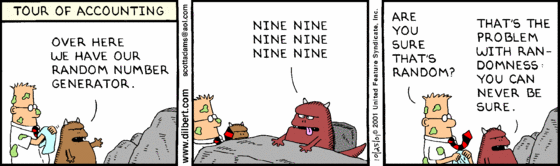

# Contents

* Conduct $\chi^2$ analyses and tests.
* Understand how to use cross tables in practice and be able to interpret the results of different associated statistics.

# Hypothesis testing

* Formulate $H_0$ \& $H_1$
* Choose the level of significance $\alpha$ (e.g. $\alpha = 0.05$)
* Select an appropriate test, based on assumptions about the properties of the underlying data (and grouping variables)
* Calculate a test statistic $T$
* Reject $H_0$ if $p(T) \leq \alpha$ or do not reject $H_0$ if $p(T) > \alpha$




## Formulation of the hypothesis

* A **null hypothesis ($H_0$)** is a statement of the status quo, one of no difference or no effect. If the null hypothesis is not rejected, no changes will be made.
* An **alternative hypothesis ($H_1$)** is one in which some difference or effect is expected. Accepting the alternative hypothesis will lead to changes in opinions or actions (= **research question**).

A null hypothesis may be rejected, but it can never be accepted based on a single test. The null hypothesis is formulated in such a way that its rejection leads to the acceptance of the desired conclusion.

*Example:*

* $H_0 = \bar{x}_{female} = \bar{x}_{male}$
* $H_1 = \bar{x}_{female} \neq \bar{x}_{male}$


## Choose significance level 

* **Type I error** (significance level, $\alpha$): occurs when the sample results lead to the rejection of the null hypothesis when it is in fact true (common values: $0.05$ or $0.01$).
* **Type II error** ($\beta$): occurs when, based on the sample results, the null hypothesis is not rejected when it is in fact false.
* **Test power** ($1 - \beta$): the probability of rejecting the null hypothesis when it is false.


## Test selection

* Select the appropriate test based on the measurement level of the variable being tested and test specific assumptions:
- measurement level of the variables (nominal, ordinal, interval/ratio)
- **independent** samples (two or more group comparisons on different observation units, also called *unpaired*) or 
**related** samples (two or more measurement points on the same observation units, also called *paired*)

* The test statistic measures how close the sample is to the null hypothesis and follows a certain distribution (e.g. normal, t, $\chi^2$,...)


## Accept/Reject

 


# Overview of univariate tests


# Nominal variables \& one sample

## $chi^2$ test

**Usage:**

* To compare a certain sample proportion of a **nominal** variable with an expected population proportion.

### Case 1: Equal proportions

* Tests the null hypothesis stating that the frequency distribution of certain events observed in a sample is consistent with a particular theoretical distribution.

**Example:** *Trump's twitter behavior (cont.)*

4901 words obtained from tweets based on Trump's **Android** phone (during the presidential election campaign in 2016) had been categorized into 10 sentiments using the NRC Word-Emotion Association lexicon.

```
# generate the data
name <- c("anger", "anticipation", "disgust", "fear","joy", "negative", "positive", "sadness","surprise", "trust")
dat <- c(rep(name[1],490), rep(name[2],428), rep(name[3],304),rep(name[4],403), rep(name[5],355), rep(name[6],820),
         rep(name[7],967), rep(name[8],450), rep(name[9],266),rep(name[10],626))
```

**Research question:** Is the sentiment of words equally distributed? or is there any sentiment that is overrepresented?

* $H_0$: all sentiments (= categories) are equal (uniform distributed)
* $H_1$: at least one sentiment differs (is more/less frequent)

Under $H_0$ you would expect a proportion of $1/10$ for all categories -> $1/10 \times N = 1/10 \times 3197 = 319.7$ observations per category
* We are testing the deviations of the `observed` values from the `expected` values.

```
# calculate absolute values (frequencies)
observed <- table(dat)
```

```
# compare it to the expected value for all categories being equally likely
# i.e. the number of observations devided by the number of categories
expected <- sum(table(dat))/10
residuum <- observed - expected
cbind(observed, expected, residuum)
```

```
# calculate the test stastistic
sum(residuum^2)/(expected)
```

```
# plot chi-square distribution
x <- rchisq(1000, 9)
hist(x, prob=TRUE, main="Chi^2 distribution with 9 degrees of freedom", xlab="")
curve(dchisq(x, df=9), col="red", lwd=2, add=TRUE )

# the corresponding 95%-quantile 
# (= for a significance level of 5%) we would be here
abline(v=qchisq(1-0.05, 9), col="red", lty="dotted", lwd=2)
# our test statistic is here 549.4091

# calculate area under the chi-square distribution 
# curve (= p-value)
1 - pchisq(549.4091, 9)
```


```
# fast: use built-in function:
chisq.test(table(dat))
```

**Interpretation:**

$H_0$} (i.e., the 10 sentiments are distributed uniformly) is **rejected** ($p < .001$). Words with a positve/negative classified sentiment are more frequent!


### Case 2: Test of independence

* Examines the relationship between two independent, nominal variables.
* **independence**: the occurrence of one does not affect the probability of the other (= no additional information about one variable can be extracted from the other). Examples: tossing a coin, measuring peoples height,...

**Example:** *Trump's twitter behaviour (cont.)*

Overall, we have 628 tweets from the iPhone, and 762 tweets from the Android. We can also see a difference involves sharing links or pictures in tweets.

```
dat <- matrix(c(10,543,423,199), ncol=2, byrow=T)
rownames(dat) <- c("Android","iPhone")
colnames(dat) <- c("picture/link","No picture/link")
dat

# make a staked barplot
barplot(dat, col=c("steelblue","grey40"))

# Obviously tweets from the iPhone are more likely to contain either a picture or a link.
```

**Research question:** Is there an association between content (w/o picture or link) of the tweet and the device used (Samsung Galaxy vs. iPhone)?

* $H_0$: the device used (rows) is independent of the content (columns).
* $H_1$: the device used is not independent of the content.
 

```
# add information (row and column sums)
addmargins(dat)

# to get conditional information devide either by row or by column sums

# condition on column information:
prop.table(dat, 2)*100 

# make a staked barplot again (using conditional information)
barplot(prop.table(dat, 2)*100, col=c("steelblue","grey40"))

# we have no space for a legend, so we force the bars to be side by side
barplot(prop.table(dat, 2)*100, col=c("steelblue","grey40"), beside=TRUE, legend=TRUE)
```

```
chisq.test(dat)
```

**Interpretation:**

$H_0$ is **rejected** ($p < .001$). Tweets from the iPhone are significantly more likely to contain either a picture or a link.


