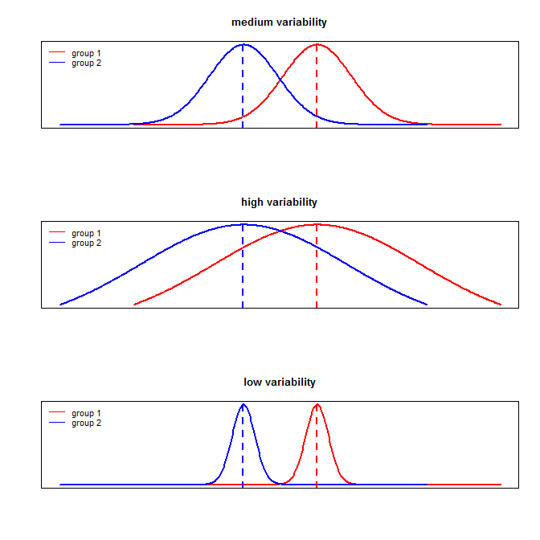
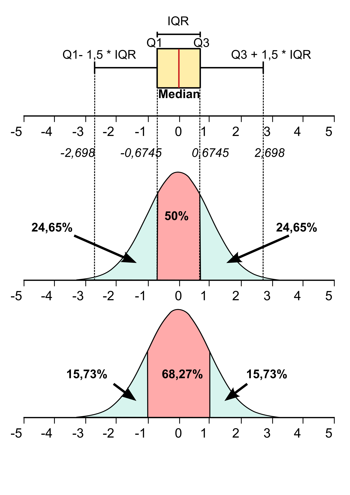

#  Objectives

* Conduct $\chi^2$ analyses and tests.
* Understand how to use cross tables in practice and be able to interpret the results of different associated statistics.
* Be able to identify situations where it is useful to test hypothesis related to differences as well as to understand the differences in use of parametric and nonparametric tests.
* Be able to conduct analysis of variance and know how to interpret the results.
* **`R`**: working with data frames, advanced graph annotations, add-on packages.

# Univariate tests


## Student t-test for independent sample means

* Examines if there is a **difference in means** between **two independent groups** (= observations are drawn from different populations, e.g. males and females, buyers and non-buyers, ...).

* Judges the difference between two group means relative to their variability:



-> small differences + loads of variability: **hard to detect**

-> large differences + low variability: **easy to detect**


### Assumptions:

* Interval scaled variables and two independent samples
* Normal distributed data in each group (two sample means)
* Equal group variances (one pooled variance)


**Example:** *human weight data*

Are males and females differing significantly within their body weight?

```
# We simulate 150 random observations for two samples from
# two different normal distributions
set.seed(1234)
female <- rnorm(150, 55, 10)   # mean=55, sd=10
male <- rnorm(150, 65, 8.5)    # mean=65, sd=8.5
sex <- rep(c("female", "male"), each=150)
wdata <- data.frame("group"=sex, "weight"=c(female,male))
head(wdata)

# calculate mean and standard deviation for the two samples
mean. <- tapply(wdata$weight, wdata$group, mean)
sd. <-  tapply(wdata$weight, wdata$group, sd)
rbind(mean., sd.)
```

**Check assumption 2: Normal distribution within both groups.**

```
# a more advanced histogramm:

hist(female, col=adjustcolor("purple", 0.6), main="", breaks=15, border=NA, prob=TRUE, xlab="Body weight", ylim=c(0,0.06))
hist(male, col=adjustcolor("steelblue", 0.6), add=T, breaks=15, border=NA, prob=TRUE)

lines(density(female, n=150, cut=5)$x, density(female, n=150, cut=5)$y, lwd=4, col="purple")
lines(density(male, n=150, cut=5)$x, density(male, n=150, cut=5)$y, lwd=4, col="steelblue")

# add a legend to the plot
legend("topleft", legend=c("female","male"), fill=c("purple","steelblue"), border=NA, bty="n", cex=2)
```


## Excursus: Boxplot

* Graphical method for depicting groups of numerical data through their quartiles.
* The spacings between the different parts of the box indicate the degree of dispersion (spread) and skewness in the data, and shows outliers.
* The bottom and top of the box are always the first (25th) and third (75th) percentile, the band inside the box is always the second (50th) percentile (the median).
* The whiskers are represented as the extend of $1.5$ times the difference between the 25th and the 75th percentile.




```
boxplot(weight ~ sex, main="Boxplot: Body weight data", col=c("purple","steelblue"), data=wdata)
```

```
# adding information 1: boxplot with data mean
boxplot(weight ~ sex, main="Boxplot: Body weight data", col=c("purple","steelblue"), data=wdata)
# mean of female group
abline(h=tapply(wdata$weight, wdata$group, mean)[1], cex=3, lwd=3, col="red")
# mean of male group
abline(h=tapply(wdata$weight, wdata$group, mean)[2], cex=3, lwd=3, col="red", lty="dotted")
```

```
# adding information 2: boxplot with data points
boxplot(weight ~ sex, main="Boxplot: Body weight data", col=c("purple","steelblue"), data=wdata)
stripchart(weight ~ sex, vertical = TRUE, data = wdata, method = "jitter", jitter=0.05, add = TRUE, pch = 16, col = adjustcolor("grey40",0.4), cex=1.25)
```


**Check Assumption 3: Homogeneity of variances.**

* **$H_0$: both samples have equal variances**.
* $H_1$ : the variances differ.

```
mean. <- tapply(wdata$weight, wdata$group, mean)
sd. <-  tapply(wdata$weight, wdata$group, sd)
rbind(mean., sd.)
```

```
# variance homogeneity can be assessed using the "Bartlett-test" (is acting like a "model check", so we want to stay with H0)
bartlett.test(wdata$weight ~ wdata$group)
```

**Conduct independent samples t-test.**

* $H_0$: the means of both samples are equal (there is no difference between the means of the two samples)
* $H_1$: the means of both samples differ

```
diff. <- mean.[1] - mean.[2]
# female sample weight is lower than the male sample weight (negative sign)
n1 <- 150
n2 <- 150
# we use the pooled "sample" variance, i.e., 1/(n-1) instead of 1/n
var. <- sqrt((1/n1 + 1/n2) * ((n1-1)*sd.[1]^2 + (n2-1)*sd.[2]^2)/(n1+n2-2))
# calculate the ratio of difference to the variance = test statistic
t. <- diff./var.
# calculate the degrees of freedom
df. <- 150 + 150 - 2
# compare the test statistic to the Student-t distribution with df=298
pt(t., df.)

# summarize the results
cbind(diff., var., t., df.)
```

```
# compare your result to the built-in function t.test use the argument "var.equal=TRUE" as the Bartlett-test states:
# H0: the group variances are equal

t.test(wdata$weight ~ wdata$group, var.equal = TRUE)
```

## Mann-Whitney U (Wilcoxon rank-sum) test

* Alternative (**nonparametric**) test, if assumption 2 (normal distribution within groups) and/or assumption 3 (equal variances) do **not** hold.
* Compares the difference in the location (**mean ranks**) of **two independent samples**.
* Has greater efficiency than the t-test on non-normal distributions.
* Particularly suitable for small sample sizes ($n_1$, $n_2$ < 10).

**Example:** *skewed data, unequal variances*

Assumption 2 (normal distribution within both groups) does not hold.

```
# simulate skewed data (non-central Student-t distribution)
set.seed(1234)
female <- rt(100, 5, ncp=55)
male <- rt(100, 10, ncp=60)
sex <- rep(c("female", "male"), each=100)
wdata2 <- data.frame("group"=sex, "weight"=c(female,male))
mean. <- tapply(wdata2$weight, wdata2$group, mean)
median. <- tapply(wdata2$weight, wdata2$group, median)
sd. <-  tapply(wdata2$weight, wdata2$group, sd)
IQR. <-  tapply(wdata2$weight, wdata2$group, IQR)
rbind(mean., median., sd., IQR.)
```


```
wilcox.test(wdata2$weight ~ wdata2$group) # wilcoxon rank-sum test
```

```
t.test(wdata2$weight ~ wdata2$group, var.equal=TRUE)  # Student t-test
```

```
t.test(wdata2$weight ~ wdata2$group, var.equal=FALSE) # Welch t-test
```
